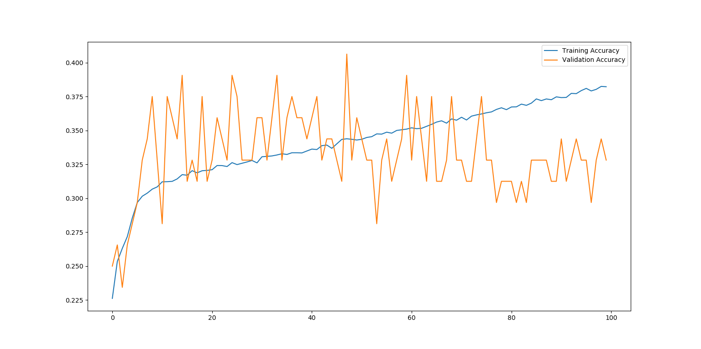

# Sentimental_Analysis of Tweet Emotions
Sentimental Analysis using Long Short Term Memory Recurrent Neural Networks (DeepLearning)
 
(40000,)
 
(40000,)
 
 
Excluding stopwords ...
 
Tokenized to Word indices as
 
(40000,)
 
After padding data
(40000, 20)
 
Loading Glove Vectors ...
 
Loaded GloVe Vectors Successfully
 
Embedding Matrix Generated :  (32855, 50)
 
Label Encoding Classes as
        { 0: 'anger', 
         
          1: 'boredom',
           
          2: 'empty', 
           
          3: 'enthusiasm',
           
          4: 'fun',
           
          5: 'happiness', 
           
          6: 'hate',
           
          7: 'love', 
           
          8: 'neutral',
           
          9: 'relief', 
           
          10: 'sadness', 
           
          11: 'surprise',
           
          12: 'worry'}
           
 
One Hot Encoded class shape :
 
(40000, 13)
  
2018-10-09 00:56:56.582717: I tensorflow/core/platform/cpu_feature_guard.cc:141] Your CPU supports instructions that this TensorFlow binary was not compiled to use: AVX2

 
x shape (4323, 300, 300, 3)
 
y shape (4323, 5)
 

| Layer(type)       	        | Output Shape           |  Param #  |
| ------------- 		          |:-------------:	       | -----:    |
| embedding_1 (Embedding)    	|  (None, 20, 50)        |   1642750 |
| conv1d_1 (Conv1D)           |  (None, 20, 30)        |   1530    |
| max_pooling1d_1 (MaxPooling1|  (None, 5, 30)         |   0       |
| lstm_1 (LSTM)               |  (None, 5, 100)        |   52400   |
| flatten_1 (Flatten)         |  ((None, 500)          |   0       |
| dense_1 (Dense)             |   (None, 500)          |   250500  |
| dense_2 (Dense)             |   (None, 300)          |   150300  |
| dense_3 (Dense)             |   (None, 13)           |   3913    |

Total params: <b>2,101,393</b> 
Trainable params: 458,643 
Non-trainable params: 1,642,750 
 
Train on 29936 samples, validate on 64 samples
  
Finished Preprocessing data ... 
x_data shape :  (40000, 20) 
y_data shape :  (40000, 13)
 
spliting data into training, testing set
 

<h1>Yeah I think, I need more data</h1>

 
Epoch 00096: val_acc did not improve from 0.40625
Epoch 97/100
29936/29936 [==============================] - 8s 277us/step - loss: 1.8189 - acc: 0.3791 - val_loss: 1.9288 - val_acc: 0.2969
  
Epoch 00097: val_acc did not improve from 0.40625
Epoch 98/100
29936/29936 [==============================] - 8s 259us/step - loss: 1.8162 - acc: 0.3803 - val_loss: 1.9488 - val_acc: 0.3281
  
Epoch 00098: val_acc did not improve from 0.40625
Epoch 99/100
29936/29936 [==============================] - 7s 249us/step - loss: 1.8131 - acc: 0.3824 - val_loss: 1.9878 - val_acc: 0.3438
  
Epoch 00099: val_acc did not improve from 0.40625
Epoch 100/100
29936/29936 [==============================] - 7s 249us/step - loss: 1.8122 - acc: 0.3822 - val_loss: 1.9144 - val_acc: 0.3281
  
Epoch 00100: val_acc did not improve from 0.40625
  
<h2>Test accuracy: 0.337</h2>

  

